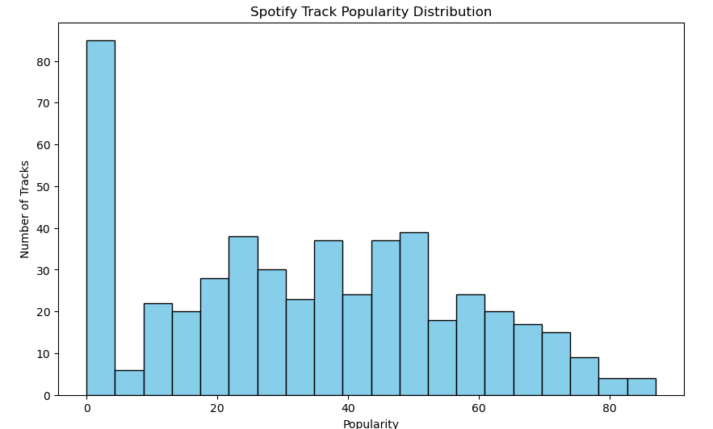
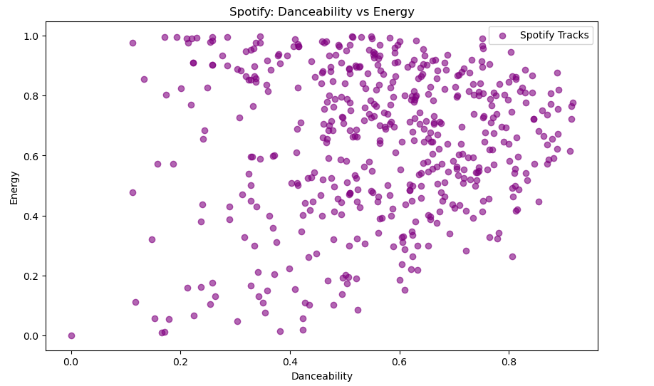

# 🎧 Spotify Data Analysis & Insights using Python

---

## 📌 Overview
This project focuses on performing Exploratory Data Analysis (EDA) on a Spotify dataset to understand the factors that influence song popularity. The analysis involves data cleaning, transformation, and visualization to extract meaningful insights.

This project demonstrates practical data analysis skills required for Data Science roles.

---

## 🎯 Objective
- Analyze Spotify dataset to identify trends and patterns  
- Understand how features like energy, danceability, and tempo affect popularity  
- Present insights using clear visualizations  

---

## 📂 Dataset
The dataset contains information about songs such as:
- Track Name  
- Artist Name  
- Popularity  
- Danceability  
- Energy  
- Tempo  
- Duration  

---

## 🛠️ Tools & Technologies
- Python  
- Pandas  
- Matplotlib  
- Jupyter Notebook  

---

## 🔄 Project Workflow

### 🧹 Data Cleaning
- Handled missing values  
- Removed duplicate records  
- Corrected data types  

### 🔄 Data Wrangling
- Normalized data  
- Encoded categorical variables  
- Structured dataset for analysis  

### 📊 Exploratory Data Analysis (EDA)
- Analyzed distribution of popularity  
- Identified top artists and tracks  
- Explored relationships between features  

### 📈 Data Visualization
- Bar charts for top artists  
- Histograms for popularity distribution  
- Scatter plots for feature relationships  

---

## 📊 Key Insights
- Songs with higher energy tend to have higher popularity  
- Danceability shows a positive relationship with popularity  
- Certain artists consistently produce popular tracks  
- Most popular songs fall within a moderate duration range  

---

## 📸 Sample Visualizations

### 🔹 Popularity Distribution


### 🔹 Feature Relationship



---

## 📁 Project Structure

```
spotify-data-analysis/
│
├── spotify_data_analysis.ipynb
├── SpotifY_DataSet1.csv
├── app.py
├── README.md
```

---

## 🚀 Future Improvements
- Use advanced visualization libraries like Seaborn  
- Add machine learning models for prediction  
- Deploy the project using Streamlit  

---

## 👩‍💻 Author
**Elaprolu Jnapika Chowdary**  
- GitHub: https://github.com/324103210046jnapika  
- LinkedIn: https://www.linkedin.com/in/elaprolu-jnapika-chowdary-b319193a3  

---

## ⭐ Conclusion
This project demonstrates the ability to perform data analysis, extract insights, and present findings effectively using Python and visualization tools.
